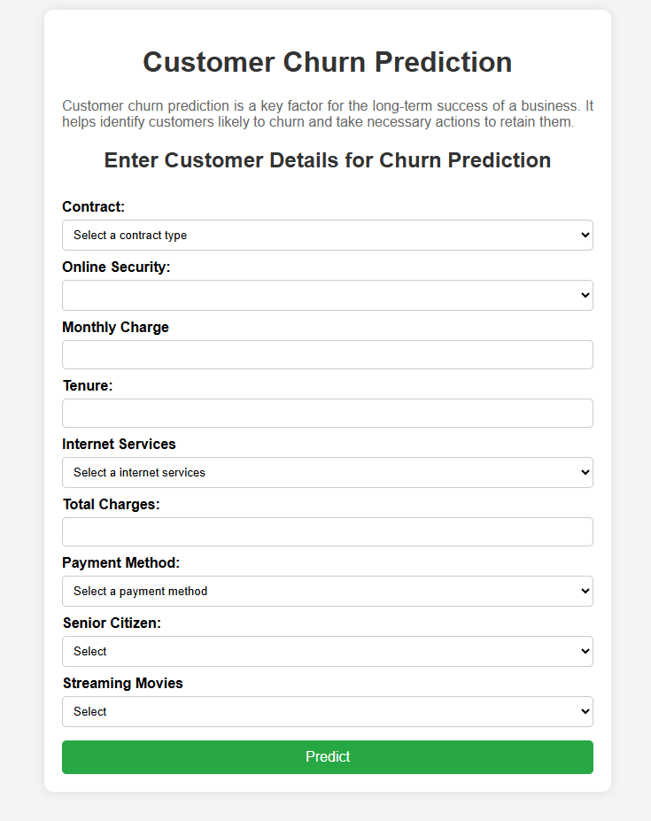
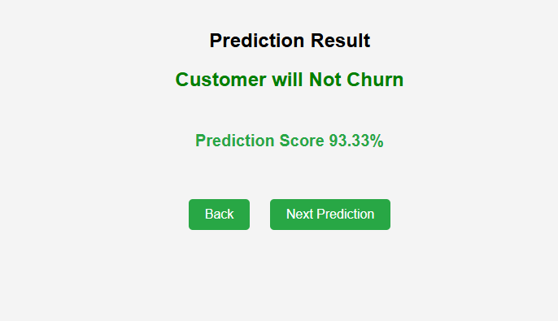

# 📡 Telecommunication Customer Churn Prediction

## 🚀 Project Overview
This project predicts whether a telecom customer is likely to churn (leave the service) based on various features. It includes:
- **Machine Learning Model:** Decision Tree classifier trained on a dataset from Kaggle
- **Deployment:** Flask-based web app for user interaction
- **Frontend:** HTML, JavaScript, and CSS (collaborated with a fellow developer)

## 📊 Dataset
- **Source:** [Kaggle - Telecommunication Customer Churn Dataset](https://www.kaggle.com/datasets/blastchar/telco-customer-churn)
- **Features:** Customer demographics, service usage, contract details, etc.
- **Target Variable:** Churn (Yes/No)

## 🛠 Technologies Used
- **Python:** `scikit-learn`, `pandas`, `numpy`, `joblib`
- **Backend:** Flask
- **Frontend:** HTML, JavaScript, CSS

## 🎯 Model Performance
- **Training Accuracy:** ~85%
- **Test Accuracy:** ~80%

## ⚙ Setup & Installation
1. **Clone this repository:**
   ```bash
   git clone https://github.com/NirajJaishwal/churn-prediction-flask-app.git
   cd telecom-churn-prediction
   ```
2. **Install dependencies:**
   ```bash
   pip install -r requirements.txt
   ```
3. **Run the Flask app:**
   ```bash
   python app.py
   ```
4. **Access the web interface:** Open `http://127.0.0.1:5000/` in your browser.

## 📸 Screenshots
### 🔹 Web Interface


### 🔹 Model Predictions


## 🏆 Key Learnings
- Feature engineering to improve model accuracy
- Deploying ML models using Flask
- Connecting frontend with backend for user interaction

## 👨‍💻 Contributors
- **Niraj Jaishwal** - Machine Learning & Backend
- **Roshan Panta** - Frontend Development

## 📝 License
This project is licensed under the MIT License.

## 📬 Contact
For any queries, feel free to connect on [LinkedIn](https://www.linkedin.com/in/niraj-kumar-jaishwal/) or email me at `nkj5@uakron.edu`.

---

🔗 **GitHub Repository:** [churn-prediction-flask-app](https://github.com/NirajJaishwal/churn-prediction-flask-app#)
